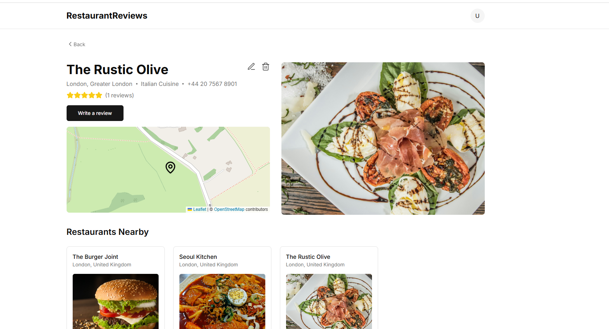
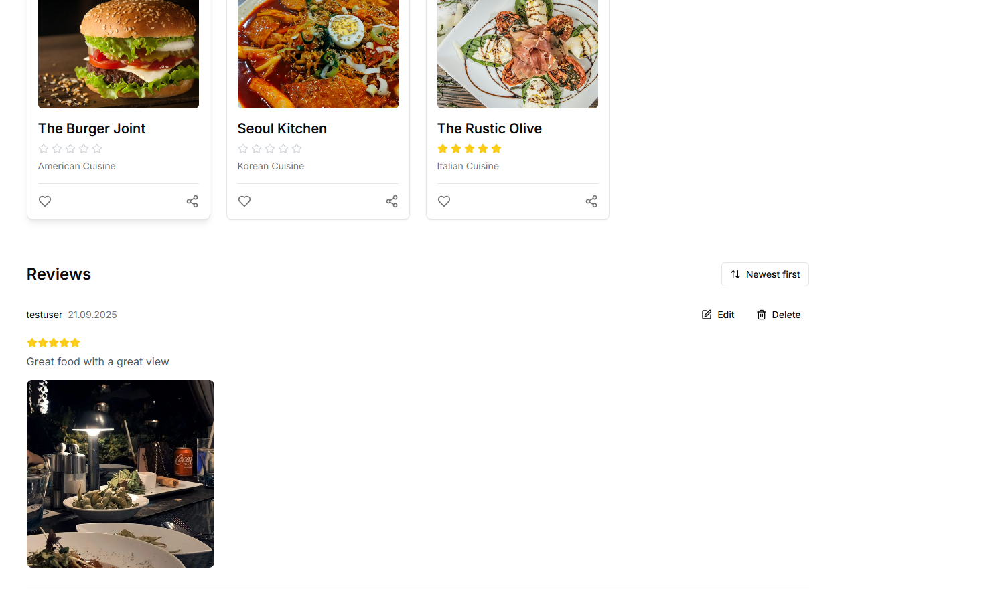

# 🍽️ Restaurant Review Platform

A Spring Boot–based **restaurant review application** that integrates with **Elasticsearch** for advanced search capabilities, **Keycloak** for authentication/authorization, and a simple **file storage service** for photo uploads.  
Users can discover restaurants, leave reviews, and explore search features such as rating filters and geo-location search.  

---

## 🚀 Features

- **User Authentication & Authorization**
  - JWT-based security with **Keycloak**
  - Public access for viewing restaurants & photos
  - Protected endpoints for creating/updating/deleting reviews and restaurants

- **Restaurant Management**
  - Create, update, delete, and retrieve restaurants
  - Store address, operating hours, photos, and geo-location
  - Average rating calculated automatically from user reviews

- **Review System**
  - Add/update/delete reviews for restaurants
  - Each user can review a restaurant only once
  - Reviews support photos and rating validation (1–5 stars)
  - Edit reviews allowed within 48 hours

- **Search & Discovery**
  - **Text search** with fuzzy matching (restaurant name & cuisine type)
  - **Filter by rating** (e.g., restaurants with ≥4 stars)
  - **Geo-distance search** (restaurants near a location within X km)

- **Photo Uploads**
  - Upload and serve photos via REST API
  - Stored on the local filesystem
  - Accessible via public endpoint

- **Error Handling**
  - Centralized exception handling with meaningful error messages
  - Validation errors (e.g., invalid input) returned in a structured format

---

## 🛠️ Tech Stack

- **Backend Framework**: Spring Boot 3
- **Security**: Spring Security, OAuth2 Resource Server, Keycloak
- **Data Store**: Elasticsearch 8
- **Build Tool**: Maven
- **Mapping**: MapStruct
- **Validation**: Hibernate Validator (Jakarta Validation API)
- **Testing**:
  - JUnit 5
  - Mockito
  - Spring Boot Test (`@WebMvcTest`, `@SpringBootTest`)
- **Containerization**: Docker & Docker Compose
- **Other Libraries**: Lombok, SLF4J logging

---

## 📂 Project Structure

```
src/main/java/com/doruk/restaurant
│── config/               # Security & configuration
│── controllers/          # REST Controllers
│── domain/
│   ├── dtos/             # Data Transfer Objects
│   ├── entities/         # Elasticsearch entities
│── exceptions/           # Custom exceptions & BaseException
│── mappers/              # MapStruct mappers
│── repositories/         # Elasticsearch repository
│── services/             # Interfaces & implementations
│── RestaurantApplication # Main application
```

---

## ⚡ Getting Started

### 1. Clone the Repository
```bash
git clone https://github.com/<dorukmenguverdi>/restaurant-review.git
cd restaurant-review
```

### 2. Start Dependencies (Elasticsearch, Kibana, Keycloak)
```bash
docker-compose up -d
```

### 3. Run the Application
```bash
./mvnw spring-boot:run
```

### 4. Access Services
- API: `http://localhost:8080`
- Elasticsearch: `http://localhost:9200`
- Kibana: `http://localhost:5601`
- Keycloak: `http://localhost:9090`

---

## 🔑 API Endpoints (Examples)

### Restaurants
- `POST /api/restaurants` → Create restaurant  
- `GET /api/restaurants?q=sushi&minRating=4` → Search restaurants  
- `GET /api/restaurants/{id}` → Get restaurant details  

### Reviews
- `POST /api/restaurants/{restaurantId}/reviews` → Create review  
- `PUT /api/restaurants/{restaurantId}/reviews/{reviewId}` → Update review  
- `DELETE /api/restaurants/{restaurantId}/reviews/{reviewId}` → Delete review  

### Photos
- `POST /api/photos` → Upload photo  
- `GET /api/photos/{id}` → Download photo  

---

## 🧪 Tests

- **Unit tests** with JUnit 5 & Mockito (`RestaurantServiceImplTest`, `PhotoServiceImplTest`)  
- **Web layer tests** with `@WebMvcTest` (`PhotoControllerTest`)  
- **Integration tests** with `@SpringBootTest` (`RestaurantDataLoaderTest`)  

Run all tests:
```bash
./mvnw test
```

---

## 📸 Screenshots

### Home Page


### Restaurant 
  

### Restaurant Review 
  
Note: The frontend shown in the screenshots is a pre-built template that I used only for demonstration purposes.
---

## 📌 Future Improvements

- Use **Testcontainers** for Elasticsearch/Keycloak in integration tests  
- Split `Review` into a separate index for scalability  
- Swagger/OpenAPI documentation for API  

---

## 👤 Author

**Doruk Mengüverdi**  
- 🎓 Management Information Systems (MIS) Student  
- 🌐 [GitHub](https://github.com/dorukmenguverdi) • [LinkedIn](https://www.linkedin.com/in/doruk-menguverdi/)  
